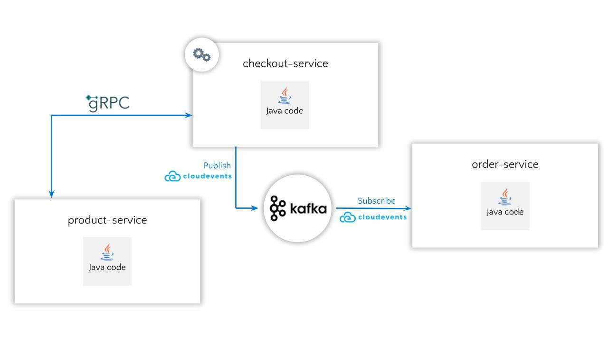

# gRPC and CloudEvents Kafka PoC
Proof of concept using [gRPC](https://grpc.io/) ([Protocol Buffers](https://protobuf.dev/)) and [CloudEvents](https://cloudevents.io/) in [Kafka](https://kafka.apache.org/). 


## Architecture



## Requisites

Start Kafka container by entering the following command:

```bash
docker compose up
```

## Build services

```bash
mvn clean install
```

## Run services

Follow the instructions in the readme file of each service to run them.
